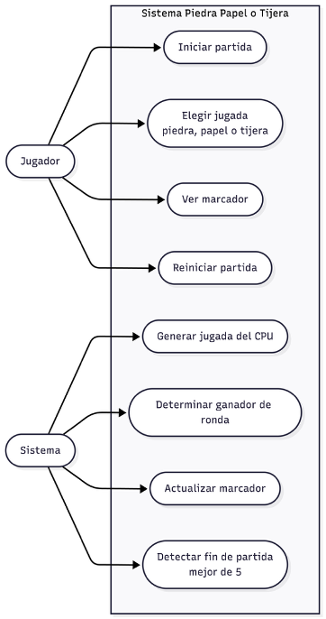
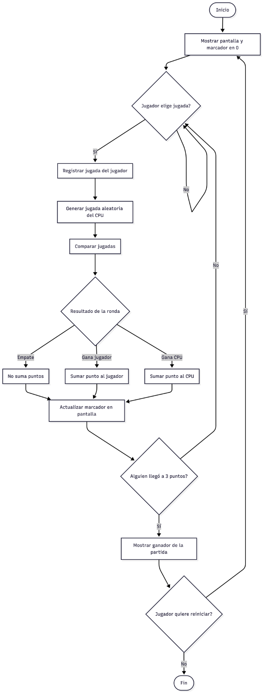
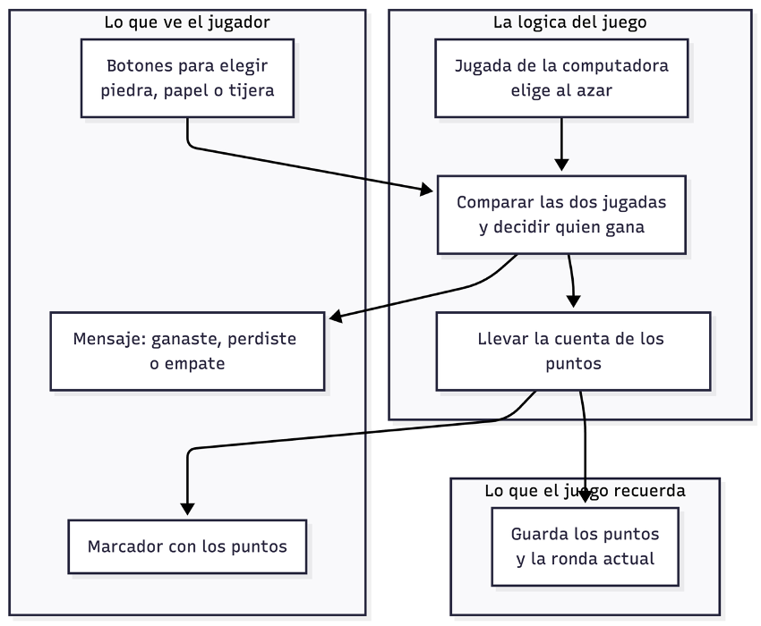

# Piedra, Papel o Tijera

Juego de Piedra, Papel o Tijera hecho en Python. El primero en llegar a 3 puntos gana la partida.

## Como ejecutar

```
python3 juego.py
```

## Conceptos usados

- Variables
- Condicionales (`if`, `elif`, `else`)
- Ciclos (`while`)
- Modulo `random`

## Diagramas de diseno

### Diagrama de Casos de Uso


### Diagrama de Flujo


### Diagrama de Arquitectura

